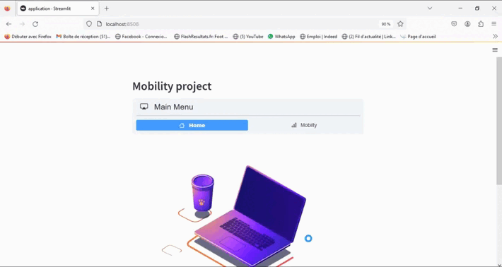

# Projet Mobility: Interface graphique
The aim is to develop an open-source software that will allow studying the mobility of individuals in a given region, for representative populations. The software will estimate various statistics such as the number of trips, distance travelled, greenhouse gas emissions, categorized by mode of transportation and purpose of travel.
# Description

<div style="text-align: center;">
  
</div>

<br>
<br>

This interface allows you to select a single or multiple departments to visualize the flow between different types of destinations such as jobs, shops, schools, administration, sports, healthcare, entertainment, museums, and restaurants. 
It shows various graphs such as the volume of active trips, volume of selected destinations, flow of destinations measured by INSEE, flow of destinations generated by the model with alpha=0 and beta=0 and flow of destinations generated by the model.

## Dataset Download

* Click [here](https://www.data.gouv.fr/fr/datasets/departements-de-france/) to find the data frame containing all departments' names if France. 


# Requirements
The requirements.txt file contains a list of all Python libraries used to implement the functions mentioned above, and they will be installed using the following method:
```
pip install -r requirements.txt
```
# Usage
* Define the path of your application file in the terminal.
* Run the graphical interface for the project mobility.
```
>> cd path
>> streamlit run application.py
```
# Visuals
For this example the motive jobs is chosen for the following departements : ["12", "48", "34", "30", "81"].
<table>
  <tr>
    <td></td>
    <td></td>
  </tr>
  <tr>
    <td></td>
    <td></td>
  </tr>
</table
<br>
<br>

# Conclusion
This interface is a WIP.
There is still room for improvement, such as: 

# Support
* [https://www.data.gouv.fr/fr/datasets/departements-de-france/](https://www.data.gouv.fr/fr/datasets/departements-de-france/)
* [Radiation model ](https://www.researchgate.net/publication/284712241_A_Generalized_Radiation_Model_for_Human_Mobility_Spatial_Scale_Searching_Direction_and_Trip_Constraint)


# License
This project is licensed.
# Authors
